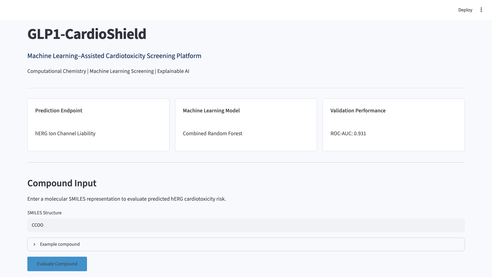
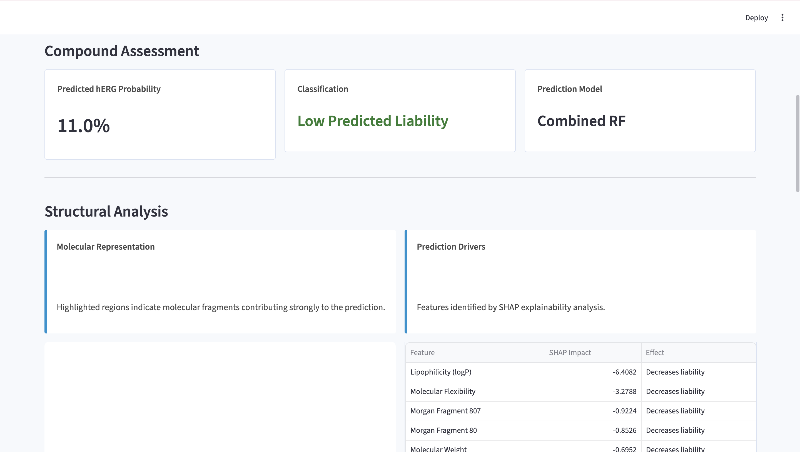
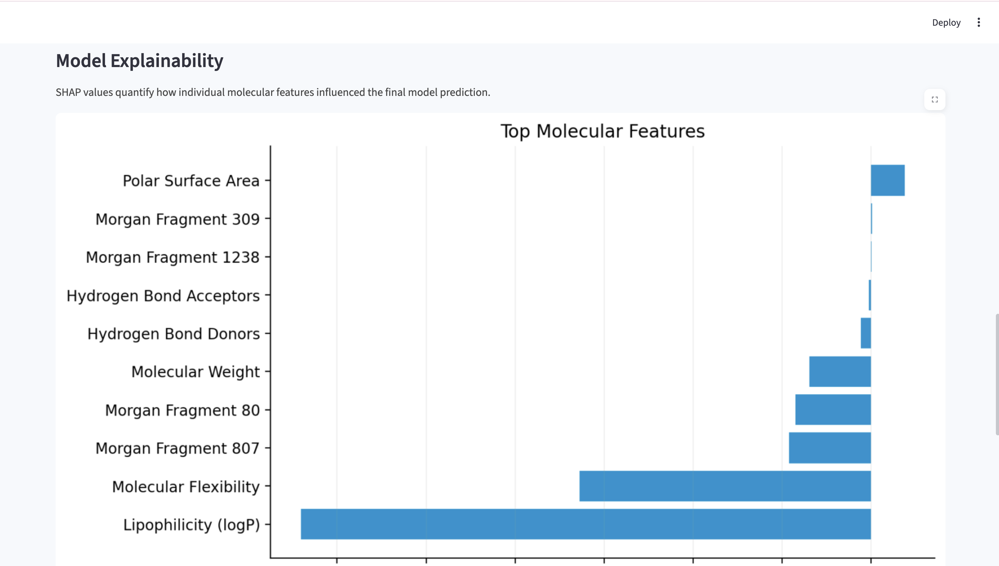
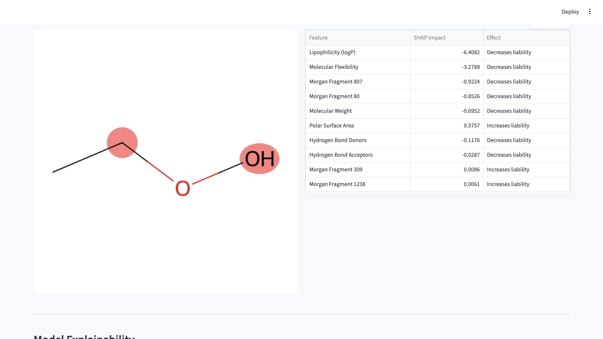
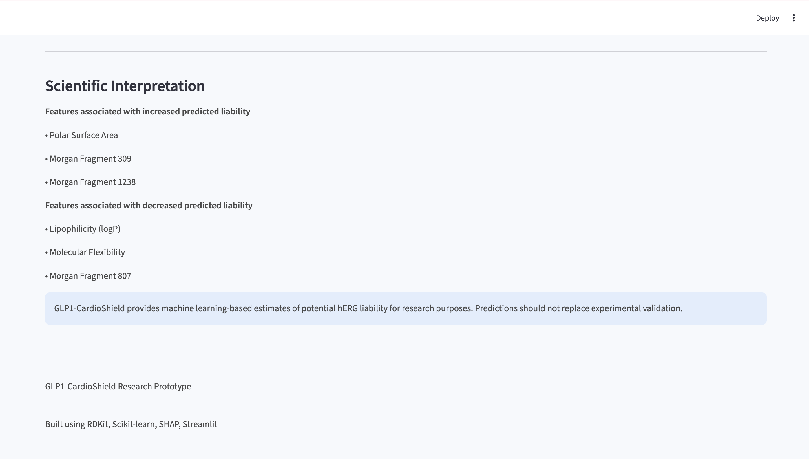

# GLP1-CardioShield

## AI-Powered hERG Cardiotoxicity Prediction using Explainable ML

CardioShield is an interpretable machine learning pipeline that predicts potential **hERG channel cardiotoxicity risk** from molecular structure.

The project combines molecular descriptors, Morgan fingerprints, Random Forest modeling, SHAP explainability, and molecular visualization to create an interactive drug screening tool for the research stage, saving resources, money, and time by eliminating the need to test cardiotoxic molecular structures, allowing researchers to focus on more viable molecular structures. 

---

## Demo

### Dashboard




### Molecular Risk Prediction




### Explainable AI



### Analysis and Diagram



### Interpretation





Users can enter a molecule using a SMILES string and receive:
-predicted hERG cardiotoxicity risk probability
-risk classification (low, high)
-SHAP-based feature explanations
-images with Highlighted molecular regions influencing prediction

---

# Features

## Molecular feature Engineering

The model extracts:

### Molecular Descriptors
-molecular weight
-lipophilicity (logP)
-hydrogen bond donors
-hydrogen bond acceptors
-rotatable bonds
-topological polar surface area
-ring structures
-aromatic rings


### Morgan Fingerprints

Circular molecular fingerprints are generated using:

-radius: 2
-2048-bit representation


---

# Machine Learning Pipeline

The workflow:

```
SMILES input
      |
      V
RDKit Molecular processing
      |
      V
Feature Extraction
      |
      v
ML Prediction
      |
      V
SHAP Explanation
      |
      V
Interactive Streamlit Dashboard
```

---

# Model performance

Multiple feature representations and algorithms were evaluated.

| Model | ROC-AUC |
|---|---:|
| Descriptor Random Forest | 0.888 |
| Morgan Fingerprint Random Forest | 0.923 |
| **Combined Random Forest** | **0.931** |
| XGBoost | 0.899 |

The final model uses a combined molecular descriptor + Morgan fingerprint representation for best results. 

---

# 🔍 Explainable AI

CardioShield uses SHAP (SHapley Additive exPlanations) to identify which molecular features contribute most strongly to predictions.

The application provides:

-feature-level contribution scores
-risk-increasing and risk-reducing factors
-molecular fragment highlighting

---

#Running the Application

## Clone the repository 

```bash
git clone <repository-url>
cd Pfizer-GLP1-CardioShield
```

## Create environment 

```bash
conda create -n rdkit_env python=3.10
conda activate rdkit_env
```

## Install the dependencies

```bash
pip install -r requirements.txt
```

## Launch streamlit app

```bash
streamlit run app/app.py
```

---

# Repository structure 

```
Pfizer-GLP1-CardioShield/

├── app/
│   └── app.py                 # Streamlit interface
│
├── src/
│   ├── pipeline.py             # Prediction + SHAP pipeline
│   ├── train.py                # Model training
│   ├── predict.py              # Inference utilities
│   └── visualize.py            # Visualization tools
│
├── models/
│   ├── random_forest_combined_herg.pkl
│   └── xgboost_combined_herg.pkl
│
├── data/
│   └── molecular datasets
│
├── results/
│   ├── model_comparison.csv
│   ├── feature_importance.png
│   └── roc_comparison.png
│
├── requirements.txt
└── README.md
```

---

# Technologies Used for this Project:

### Machine Learning
-Python
-Scikit-learn
-random Forest
-XGBoost
-SHAP
### Computational Chemistry
-RDKit
-Morgan fingerprints
-Molecular descriptors
### Application
-Streamlit
-Matplotlib
-Pillow


---

# Disclaimer

CardioShield is designed for **research and educational purposes only**.

Predictions should not replace experimental validation, clinical testing, or regulatory evaluation. GLP1-CardioShield's intended purpose is to eliminate molecules with high cardiotoxicity risk, rather than to confirm low cardiotoxicity risk without validation. 


